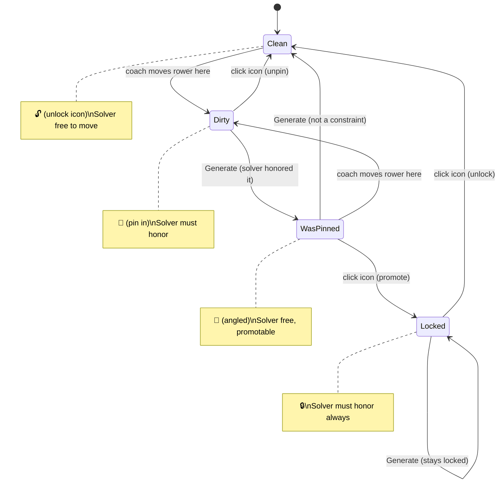

# Seat pin/lock state machine

Each seat in the lineup editor has a pin/lock state that controls
whether the solver is free to reassign it on the next Generate.

## States

| State | Icon | Solver constraint? | Description |
|-------|------|--------------------|-------------|
| **Clean** | 🔓 (unlock) | No | Default. Solver placed this rower, or the seat is unmodified. The solver is free to move this rower on re-generation. |
| **Dirty** | 📌 (pin in) | Yes | Coach manually moved a rower into this seat (swap, place from bench). The solver must honor this placement on the next Generate. Clicking the icon resets to Clean. |
| **Was-pinned** | 📌 (angled) | No | This seat was Dirty on the previous generation — the solver honored it. It is no longer a constraint going forward; the solver can freely reassign. Clicking the icon promotes to Locked. |
| **Locked** | 🔒 (lock) | Yes, always | Coach explicitly locked this seat. The solver must honor this placement on every Generate. Clicking the icon resets to Clean. |

## Transitions

### Trigger: coach moves a rower

When the coach swaps two rowers or places a rower from the bench into
a seat, the destination seat becomes **Dirty**. The source seat (if it
was occupied) also becomes Dirty with its new occupant — or Clean if
it's now empty.

### Trigger: Generate / Re-generate

When the solver runs:

- **Dirty** seats are passed to the solver as seat locks. After
  generation, they transition to **Was-pinned** (the solver honored
  them, but they won't constrain the next run).
- **Locked** seats are passed to the solver as seat locks. After
  generation, they stay **Locked**.
- **Was-pinned** seats are not constraints — the solver is free to
  reassign them. After generation, they transition to **Clean**.
- **Clean** seats are free. They stay **Clean** after generation.

### Trigger: click the icon

Each state has exactly one click action:

- **Clean** (🔓) — no click action (seat is already free).
- **Dirty** (📌) — click resets to **Clean** (coach unpins their
  manual placement).
- **Was-pinned** (📌 angled) — click promotes to **Locked** (coach
  decides to keep this placement permanently).
- **Locked** (🔒) — click resets to **Clean** (coach unlocks).

## Implementation notes

The state is tracked as a query param per seat:

- `lock=rower_id:boat_id:seat` — Locked seats (explicit coach locks)
- `pin=rower_id:boat_id:seat` — Dirty seats (manual edits since last generate)
- `was_pin=rower_id:boat_id:seat` — Was-pinned seats (honored last generate)

Clean seats have no param — they're the default.

On Generate, the handler:
1. Passes `lock` + `pin` params to the solver as seat locks
2. In the response, converts `pin` → `was_pin` and `was_pin` → (removed)
3. `lock` stays as `lock`
